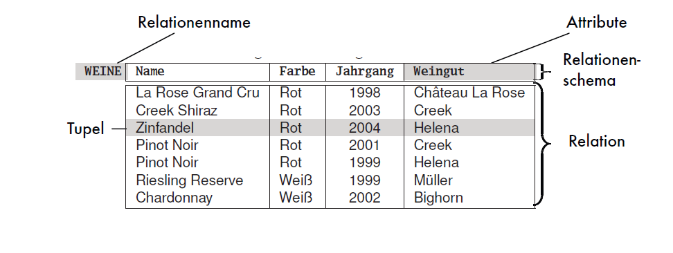
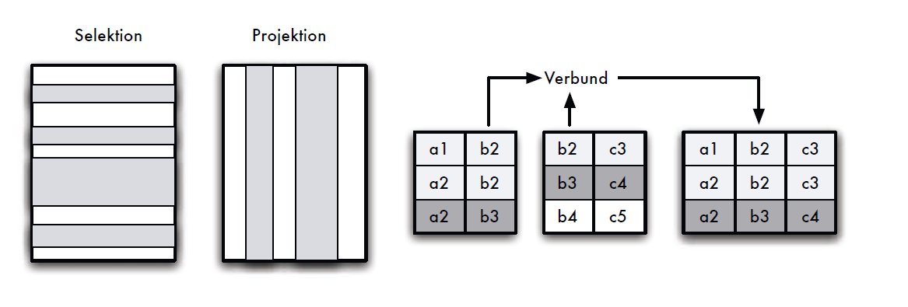
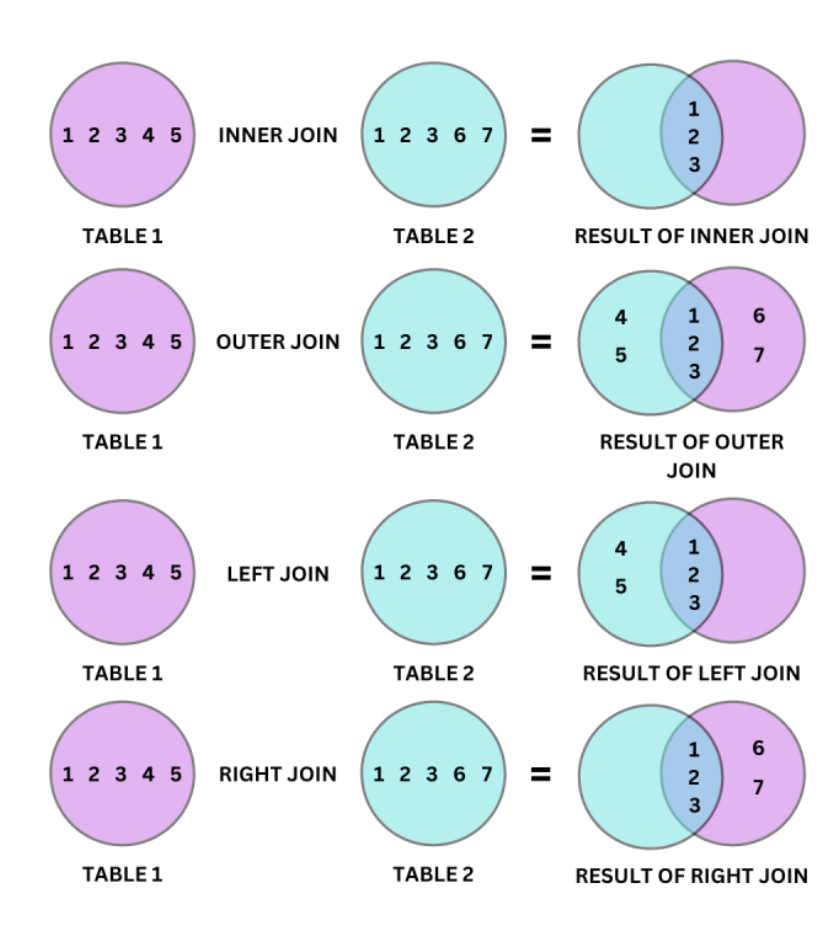
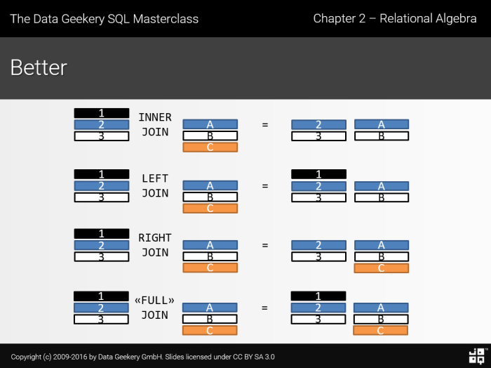

# Session 2
## Erläutern Sie das Grundkonzept des Relationenmodells (Schema, Instanz, Attribut, Tupel,...). Was ist der Unterschied zwischen Tabelle und Relation?

- Tabelle -> gesamte Einheit der Datenhaltung (Daten + Schema)
- Schema (R) -> Beschreibung eines Datensets (Attributnamen + Attributtypen + Constraints)
- Basisrelation -> Gesamtheit der Daten zu einem Tabellenschema
- Relation (r)(Instanz) -> Set von Datensätzen zu einem gegebenen Relationenschema "Teilmenge des kartesischen Produkts über den Wertebereichen der Attribute des Relationenschemas"
- Tupel -> Ein einzelner Datensatz eines Schemas
- Attribut ->  Einzelnes benanntes Datenfeld eines Tupels

## Welche Integritätsbedingungen (lokal und global) gibt es im Relationenmodell? Geben Sie dabei v.a. die Schlüsselbedingung und die Fremdschlüsselbedingung exakt und vollständig an.
### lokal
#### Schlüssel-Attribute
Schlüssel-Attribute müssen lokal in der Relation einzigartig sein -> keine 2 Tupel mit gleichem Schlüssel.
In jedem Schema muss ein Primärschlüssel festgelegt sein
### global
#### Fremdschlüssel
Referenzierte Fremdschlüssel aus anderen Tabellen müssen:
- Schlüssel-Attribut der anderen Tabelle sein
- Referenzierte Schlüsselwerte müssen existieren

## Welche Basisoperationen bietet die relationale Algebra?
- Attribute ausblendend (Projektion) &pi; -> Parameter: zu erhaltende Attribute
- Tupel herausuchen (Selektion) &sigma; -> Parameter: Bedingungen / Anforderung an Tupel
- Relationen Verknüpfen (Verbund/Join) &#10781; -> Verknüpfung der Tupel zweier Relationen über gleich benannte Attribute bei gleichem Wert
- Relationen vereinigen (Vereinigung) &cup; -> Zusammenschluss zweier relationen (gleiches Schema?). Doppelte Tupel werden entfernt
- Relationen voneinander Abziehen(Differenz) - ->
- Attribute umbenennen () &beta;

## Welche Integritätsbedingungen gibt es in SQL?
1. Typintegrität 
   - Datentyp
   - Wertebereich 
   - Null-Werte 
2. Schlüsselintegrität
   - Einzigartigkeit der Schlüsselfelder 
3. Referentielle Integrität
   - Referenziertes Attribut ist Schlüsselattribut
   - Schlüsselwert existiert
4. Check Klauseln
   - eigens erstellte Integritätsregeln
   - für einzelne Tupel  
5. Assertion Klauseln
   - eigens erstellte Integritätsregeln
   - mehrere Relationen und Tupel möglich 
  
## Erläutern Sie das Grundprinzip von Triggern anhand von Beispielen. Wie kann man Trigger als Hilfsmittel zur Integritätssicherung einsetzen?

## Erläutern Sie das Grundprinzip des SFW-Blocks von SQL-Anfragen anhand eines Beispieles. Wie unterscheidet sich dieser "SQL-Kern" von den Basisoperationen der relationalen Algebra?
SELECT-FROM-WHERE

## Erläutern Sie die verschiedenen Arten von Verbunden anhand von Beispielen. Was bewirkt die Auflistung mehrerer Relationen in der from-Klausel ohne weitere Einschränkungen?

## (F) Warum eignen sich Venn-Diagramme nicht um Verbundoperationen darzustellen?
- Keine Mengen gleichartiger Tupel
- Die Unvollständigkeit der resultierden Tupel der Projektionsliste wird nicht dargestellt
### Schlechtes Beispiel

### Besseres Beispiel

## Erläutern Sie die Möglichkeiten der select-Klausel. Was bedeutet dabei distinct?
- Definition der Projektionsliste
  - Attributname
    - müssen eingeutig sein (vereinigungen in FROM Klausel)
  - arithmetische Ausdrücke
  - aggreations Funktionen
- distinct reduziert die Projektionsliste zu einer Menge
  - default: Multimenge

## Erläutern Sie die Möglichkeiten der where-Klausel anhand von Beispielen. Gehen Sie dabei auch auf Verbundbedingungen ein.
- Filtern der Projektionsliste
- Es kann jeglicher boolsche Ausdruck verwendet werden
- 